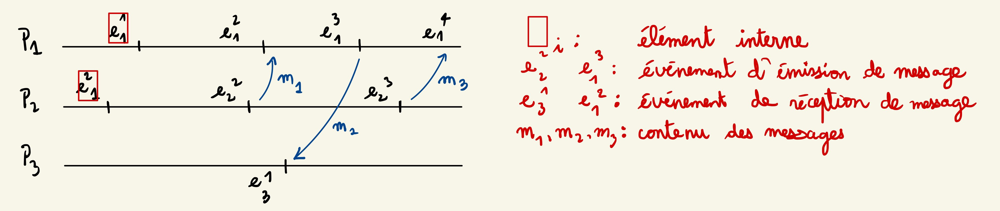
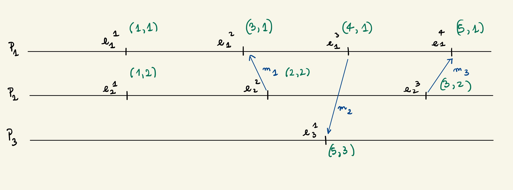
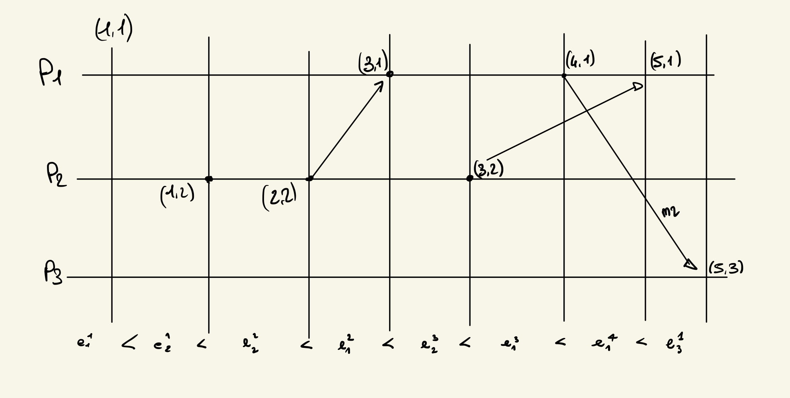

---
title: Algorithmique et programmation distribuée
author: Zakaria EJJED
documentclass: article
header-includes:
    - \usepackage{algorithm}
    - \usepackage{algpseudocode}
    - \usepackage{tikz}
    - \usepackage{fancyhdr}
toc: true
geometry:
    - margin=2cm
...

\pagestyle{fancy}
\newcommand{\deer}{\includegraphics[height=1.5cm]{/home/zakaria/Pictures/deer_sig.png}}
\fancyfoot[RE,RO]{\deer}
\pagebreak

# Wednesday February 1st 2023

Un graphe: G(V,E) $\to$ (ensemble sommet, ensembles arêtes)

V=1,2,3,4 | E=[(1,2),(2,3),(3,4)(2,4)}

\begin{center}
\begin{tikzpicture}[node distance={15mm},main/.style = {draw, circle}] 
\node[main] (1) {1};
\node[main] (2) [right of=1] {2}; 
\node[main] (3) [below of=2] {3}; 
\node[main] (4) [right of=3] {4}; 
\foreach \from/\to in {1/2,2/3,3/4,2/4}
    \draw (\from) -- (\to);
\end{tikzpicture} 
\end{center}

degré d'un sommet x $\in$ V

d(x)=nombre  de ses voisins dans le graphe

exemple: d(2)=3

soit un graphe à n sommets

G=(V,E), |V|=4 (ordre du graphe), max:n-1 min:0

**Exercice: Modelisation d'un problème**

Montrer que dans un groupe de personnes (___n noeuds___), il y a toujours 2 personnes 
qui connaissent (___arêtes___) le même nombre de membres d'un groupe.

Par l'absurde, opposons que les n noeuds ont tous un degré différent

$\to$ contradiction: un noeuds doit avoir un degré n-1

$\to$ Un noeud doit avoir un degré 0 ou il y a n noeuds et n degrés différents possibles
or ces 2 noeuds sont pas connecté.

**Graphe orienté:**Un graphe dans lequel les arêtes (_arc_) ont une direction.

G=(V,A) $\to$ (sommets,arcs)

\begin{center}
\begin{tikzpicture}[node distance={15mm},main/.style = {draw, circle}] 
\node[main] (1) {1};
\node[main] (2) [right of=1] {2}; 
\node[main] (3) [below of=2] {3}; 
\node[main] (4) [above left of=2] {4}; 
\foreach \from/\to in {2/1,3/2,4/2}
    \draw[->] (\from) -- (\to);
\end{tikzpicture} 
\end{center}

V=1,2,3,4 | A =(2,1) (3,2) (4,2) $\to$ (_origine_,_extremité_)

Pour le somemt x

degré entrant: nombre d'arcs dans lequel x extremité

degré sortant: nombre d'arcs dans lequel x origine

d$^+$(x) | d$^-$(x)

**Exemple de graphes:**

* ___graphe complet___: toutes les arêtes sont presentes
$$\text{nombres d'arête }=\frac{n(n-1}{2}$$ 

\begin{center}
\begin{tikzpicture}[node distance={15mm},main/.style = {draw, circle}] 
\node[main] (1) {1};
\node[main] (2) [right of=1] {2}; 
\node[main] (3) [below of=2] {3}; 
\node[main] (4) [left of=3] {4}; 
\foreach \from/\to in {1/2,2/3,3/4,4/1,1/3,2/4}
    \draw (\from) -- (\to);
\end{tikzpicture} 
\end{center}

* ___graphe biparti___:

\begin{center}
\begin{tikzpicture}[node distance={15mm},main/.style = {draw, circle}] 
\node[main] (1) {1};
\node[main] (2) [right of=1] {2}; 
\node[main] (3) [below of=1] {3}; 
\node[main] (4) [below of=2] {4}; 
\node[main] (5) [below of=3] {5}; 
\node[main] (6) [below of=4] {6}; 
\node[main] (7) [below of=5] {7}; 
\node[main] (8) [below of=6] {8}; 
\foreach \from/\to in {1/2,2/3,3/4,4/1,4/7,5/8,3/6}
    \draw (\from) -- (\to);
\end{tikzpicture} 
\end{center}

* ___Arbres___: graphe qui n'a pas de cycles.\
**cycle:**\
\begin{center}
\begin{tikzpicture}[node distance={15mm},main/.style = {draw, circle}] 
\node[main] (1) {1};
\node[main] (2) [right of=1] {2}; 
\node[main] (3) [below of=2] {3}; 
\node[main] (4) [left of=3] {4}; 
\foreach \from/\to in {1/2,2/3,3/4,4/1}
    \draw (\from) -- (\to);
\end{tikzpicture} 
\end{center}\
Nombre d'arêtes dans un arbre, sans sommet de degré 0: n-1\
\begin{center}
\begin{tikzpicture}[node distance={15mm},main/.style = {draw, circle}] 
\node[main] (1) {1};
\node[main] (2) [below left of=1] {2}; 
\node[main] (3) [below right of=1] {3}; 
\node[main] (4) [below right of=2] {4}; 
\node[main] (5) [below left of=2] {5}; 
\node[main] (6) [below right of=3] {6}; 
\foreach \from/\to in {1/2,1/3,2/4,2/5,3/6}
    \draw[->] (\from) -- (\to);
\end{tikzpicture} 
\end{center}

* ___arbres enracinés___: Arbres non orienté dans lequel on distingue un noeud racine.

\begin{center}
\begin{tikzpicture}[node distance={15mm},main/.style = {draw, circle}] 
\node[main] (1) {R};
\node[main] (2) [below left of=1] {2}; 
\node[main] (3) [below right of=1] {3}; 
\node[main] (4) [below right of=2] {4}; 
\node[main] (5) [below left of=2] {5}; 
\node[main] (6) [below right of=3] {6}; 
\foreach \from/\to in {1/2,1/3,2/4,2/5,3/6}
    \draw (\from) -- (\to);
\end{tikzpicture} 
\end{center}\
Feuille d'un arbre: sommets de degré 1 qui n'est pas la racine.

**Chemin:** ensemble de sommets $x_1,x_2,x_3,...,x_{n-1},x_n$

tel que ($x_1,x_2,x_3,...,x_{n-1},x_n$) sont des arêtes

\begin{center}
\begin{tikzpicture}[node distance={15mm},main/.style = {draw, circle}] 
\node[main] (3) {3}; 
\node[main] (1) [above left of=3] {1};
\node[main] (2) [above right of=3] {2}; 
\node[main] (4) [below of=3] {4}; 
\foreach \from/\to in {1/2,1/3,3/2,3/4}
    \draw (\from) -- (\to);
\end{tikzpicture} 
\end{center}

___longueur chemin:___ nombre de ses arêtes

___père d'un noeud x:___ soit h(x) sa hauteur, Son père est son voisin dont la hauteur vaut 
h(x)-1

___fils d'un noeuf:___ comme le père mais h(x)+1

___mini exo:___

Soit un arbre à n noeuds\
$\to$hauteur max $\Rightarrow$ n-1 (arbre chemin)\
$\to$hauteur min $\Rightarrow$ 1 (n feuilles)\
$\to$hauteur quand un noeud a exactement 2 fils $\Rightarrow 2^{h-1} \leq n \leq 2^h$

Soit un graphe avec n sommets, $s_1,s_2,...,s_n$

Montrer que $\sum_{i=1}^{n} d(s_i)$ est paire.

Dans la $\sum$ des degrés: chaque arête est compté 2 fois, une fois pour chaque extremité.

**Exercice:** Montrer que le nombre de sommets de degré impaire est paire.

On sait que la somme des degrés est paire, donc pour chaque sommet de degré impaire,
il doit y avoir un second sommet de degrés impaire.

Dans le cas où on aurait un nombre impaire de sommet de degré impaire, la somme des degrés 
serait elle aussi impaire.

Montrer que dans un arbre avec + de 2 sommet, il y a au moins deux sommets de degré 1.

$\to$ En supposant n $\geq$ 2 et un noeud de degré 1.
$$\sum_{i=1}^n d(s_i) \geq 2\times (n-1)+1$$

* ___Complexité - notion :___\
Notation de ___Landeau___: $O(f(x))=g(x)$

* ___informel:___\
à partir d'un certain x, la valeur $g(x)$ sera inférieur à $f(x)$

//COURBE

* ___formellement:___\
on écrit 
$$\begin{array}{lll}
f(x)&=&O(g(x))\\
f(x)&\in &O(g(x))
\end{array}$$\
$$\text{Ssi: }\forall x \geq x_0, \exists k \in N \text{ tel que }|f(x)|\leq k|g(x)|$$\
__Exemple:__
$$\begin{array}{lll}
f(x)&=&x\\
g(x)&=&x^x
\end{array}$$

//COURBE 4

$$x_0=1 \quad k=1 \quad f(x)=O(g(x))$$

Lors d'une compétition il y a 13 joueurs, est-ce qu'il est possible que chaque joueur
participe à exactement 3 matchs.

* ___système distribué:___ un ensemble de noeuds de calculs, autonomes interconnecté et
pouvant communiquer

* ___représenté par un graphe:___ 
\begin{align*}\text{1 noeud de calcul }&\text{= 1 sommet}\\ \text{1 lien de com }&
\text{= 1 arête}\end{align*}

* 1 noeud n'a accès en lecture/écriture qu'à sa propre mémoire. Tout le reste lui est
envoyé sous forme de message. Un noeud a une vision locale du réseau. Il faut souvent
résoudre des problèmes globaux.

* ___objectif:___ résoudre problèmes globaux à l'aide d'algos locaux\
$\to$ Les noeuds vont devoir communiquer entre eux par passage de message.\
$\hookrightarrow$ 1 noeud peut recevoir 1 message (on sait qui nous l'a envoyé).
$\hookrightarrow$ 1 noeud peut envoyer 1 message à son voisin.

___mini exemple:___

\begin{center}
\begin{tikzpicture}[node distance={15mm},main/.style = {draw, circle}] 
\node[main] (1) {$x_1$}; 
\node[main] (2) [right of=3] {$x_2$}; 
\foreach \from/\to in {1/2}
    \draw (\from) -- (\to);
\end{tikzpicture} 
\end{center}

___On veut un algo:___ à la fin de l'execution chaque noeud connait la valeur var max dans le
réseau.

chaque noeud envoie son var à son voisin

___calcul:___ sur réception de var faire le calcul de max (var $x_1$, var $x_2$)

# Wednesday February 8th 2023

 * **2 types d'évenements exterieur:**\
 a.\
  -évènement initial $\to$ bout de code\
  -il est executé initialement sur un ensemble non vide, le noeud du système\
  -1 seule fois\
  -il ne peut pas être executé sur 1 noeud qui a déjà fait du code\
  b.\
  -réception

\begin{center}
\begin{tikzpicture}[node distance={15mm},main/.style = {draw, circle}] 
\node[main] (1) {1}; 
\node[main] (2) [below left of=1] {2}; 
\node[main] (3) [below of=2] {3}; 
\node[main] (4) [right of=3] {i}; 
\foreach \from/\to in {1/2,2/3,2/4,3/4}
    \draw (\from) -- (\to);
\end{tikzpicture} 
\end{center}

**Algo: pour le noeud i**\
 1.
 * description des variables\
 2. 
 * event initial: (des regles gardés)\
 * sur réception des messages: prends code classique

 * **Les types de variables:**\
 * locals: on les indices par l'identifiant du site|noeud i \
 * $\hookrightarrow$ connaissance: elles ne sont accessibles qu'en lecture, elles servent
 à décider le système\
 par ex: voisin i, l'ensemble des voisin du sommet\
 * $\hookrightarrow$ variables locales au site pour les calculs. Elles sont accessible en lecture/ecriture.

 * variables de communication\
 B - \
 -Elle contient une info qui est transmise\
 +info du site emetteur\
 -elles ne sont pas indices\
 -elles sont ephemere.

**Calcul des max dans une chaine**

 
\begin{center}
\begin{tikzpicture}[node distance={15mm},main/.style = {draw, circle}] 
\node[main] (1) {1}; 
\node[main] (2) [right of=1] {2}; 
\node[main] (3) [right of=2] {3}; 
\node[main] (4) [right of=3] {x}; 
\foreach \from/\to in {1/2,2/3}
    \draw (\from) -- (\to);
\foreach \from/\to in {3/4}
    \draw[dashed] (\from) -- (\to);
\end{tikzpicture} 
\end{center}

* **Algo pour i:**

 * connaissance:\
 \underline{voisin i:} ensemble des voisins de i dans la chaine\
 \underline{valeur i:} valeur entiere du noeud i

 * variables:\
 \underline{max i :} le maximum dourant calculé sur i

 ___Initialement___ (description de l'evenement initial)  \*sur tous les noeuds\*
$\qquad$ envoyer Msg(val i) à voisin i

\begin{algorithm}
\caption{INIT}\label{alg:cap}
\begin{algorithmic}
\State envoyer Msg(val$_i$) à vois$_i$
\end{algorithmic}
\end{algorithm}

\begin{algorithm}
\caption{Sur réception de Msg(v) ($\leftarrow$ données) de j ($\leftarrow$ noeud 
émetteur)}\label{alg:cap}
\begin{algorithmic}
\If{max$_i < v_i$}
    \State $max_i \gets v_i$
\ElsIf{$|vois_i| = 2$}
    \State envoyer Msg(v) à vois$_i$ sans \{j\}
\EndIf
\end{algorithmic}
\end{algorithm}

**Init**:

\begin{center}
\begin{tikzpicture}[node distance={15mm},main/.style = {draw, circle}] 
\node[main] (1) {2}; 
\node[main] (2) [right of=1] {5}; 
\node[main] (3) [right of=2] {6}; 
\foreach \from/\to in {1/2,2/3}
    \draw (\from) -- (\to);
\foreach \from/\val/\to in {1/7/2,2/2/3}
    \draw[->] (\from) to [out=-80,in=-100, looseness=1] node[below] {\val} (\to);
\foreach \from/\val/\to in {2/2/1,3/13/2}
    \draw[->] (\from) to [out=100,in=80, looseness=1] node[above] {\val} (\to);
\end{tikzpicture} 
\end{center}

\begin{center}val$_2$=7; val$_5$= 2; val$_6$=13\end{center}
\begin{center}max$_2$=7; max$_5$=13; max$_6$=13\end{center}

$$\begin{array}{ll}
2 & \to 5\\
5 & \to 2 \to 6\\
6 & \to 5\\
\end{array}$$

O(n$^2$) mémoire \qquad O(n+m) (m étant le nbres d'arêtes)

## Complexité

\begin{center} Configuration + Execution + complexité en temps\end{center}
$$ A \qquad\qquad\qquad B \qquad\qquad\qquad C$$

### A - Configuration
"screenshot" de votre système à 1 instant donné

$$\begin{array}{ll}
&\to \text{états des variables de tous les sites}\\
+& \to \text{exo des messages en transit}\\
=&\text{état local de tous les sites et les messages en transit}
\end{array}$$

### B - Execution

 * Dans 1 config donnée, 1 site est activable si il existe 1 evenement exterieur qui a été déclenché et qui est en attente de traitement\
 * Execution: une sequence C$_1$, C$_2$,\dots,C$_i$,C$_{i+1}$,\dots,C$_n$\
 telle que entre 2 config consecutives:
 - tous les sites activables ont executé les actions associées aux event exterieur 
 (modifs des états locaux)
 - les autres ne font rien

\begin{center}
\begin{tikzpicture}[node distance={15mm},main/.style = {draw, circle}] 
\node[main] (1) {a}; 
\node[main] (2) [right of=1] {b}; 
\node[main] (3) [right of=2] {c}; 
\foreach \from/\to in {1/2,2/3}
    \draw (\from) -- (\to);
\end{tikzpicture} 
\end{center}

\begin{center}val$_a$=3; val$_b$= 7; val$_c$=9\end{center}
\begin{center}max$_a$=3; max$_b$=7; max$_c$=9\end{center}

$$\Downarrow$$

\begin{center}
\begin{tikzpicture}[node distance={15mm},main/.style = {draw, circle}] 
\node[main] (1) {a}; 
\node[main] (2) [right of=1] {b}; 
\node[main] (3) [right of=2] {c}; 
\foreach \from/\to in {1/2,2/3}
    \draw (\from) -- (\to);
\foreach \from/\val/\to in {1/3/2,2/7/3}
    \draw[->] (\from) to [out=-80,in=-100, looseness=1] node[below] {\val} (\to);

\foreach \from/\val/\to in {2/7/1,3/9/2}
    \draw[->] (\from) to [out=100,in=80, looseness=1] node[above] {\val} (\to);
\end{tikzpicture} 
\end{center}

le problème qui apparait est que tous les messages ne circulent pas à la meme vitesse. Par
conséquent, ils n'arrivent pas en meme temps, ce qui crée de l'indeterminisme.

La complexité en tmps est donc le tmps de la plus longue exectution possible.

\begin{center}
\begin{tikzpicture}[node distance={15mm},main/.style = {draw, circle}] 
\node (1) {}; 
\node[main] (2) [above right of=1] {a}; 
\node[main] (3) [right of=2] {b}; 
\node[main] (4) [right of=3] {c}; 
\node[main] (5) [below right of=1] {a}; 
\node[main] (6) [right of=5] {b}; 
\node[main] (7) [right of=6] {c}; 
\foreach \from/\val/\to in {1/$C_2$/2,1/$C'_2$/5}
    \draw[->] (\from) -- node [above,sloped]{\val} (\to);
\foreach \from/\to in {2/3,3/4,5/6,6/7}
    \draw (\from) -- (\to);
\foreach \from/\val/\to in {2/3/3,3/7/4,5/3/6}
    \draw[->] (\from) to [out=-80,in=-100, looseness=0.5] node[below] {\val} (\to);
\foreach \from/\val/\to in {4/9/3,6/7/5}
    \draw[->] (\from) to [out=100,in=80, looseness=0.5] node[above] {\val} (\to);
    \draw[->] (6) to [out=100,in=80, looseness=0.3] node[below] {9} (5);
\end{tikzpicture} 
\end{center}

$$C_2: \text{Si msg(7) de b est reçu par a}$$
$$C'_2: \text{Si msg(7) de b est reçu par c, msg(9) reçu par b}$$

$\to$ On observe qu'il existe plusieur execution possible pour 1 meme algo/reseau.
Cela est du à un non determinisme provoqué par le tps de transit des msg qui est variable.

cas de figure: (execution asynchrone)

La complexité en tps va etre la longueure de la plus longue execution possible, parmis ttes les executions.

b - hypothèse synchrone:

 * l'ensemble des msgs en transit est réceptionné en 1 unité de tps
 * Entre 2 config, on a 1 round
 * $\to$ tous les msg sont récéptionnés + toutes les règles gardées associées ...
 $$\downarrow$$
 le round se termine et on est dans 1 round config.

 Dans cette hypothese: la complexité en tps = nbr de noeuds (il n'y a plus qu'une exec 
 possible)

 **Terminaison des algorithmes**

 1 algo termine quand dans toutes les exec il existe une config contenant aucun msg en transit et dans lequel aucun site n'a de regle gardées à vrai

 - terminaison explicite: Il existe au moins 1 site qui sont que l'algo se termine $\hookrightarrow$
 c'est indiqué stop-globaldans le code.

 - terminaison locale: 1 site sait qu'il a terminé sans que la terminaison soit associée pr le reste des noeuds
 $\to$ dénoté dans le code par stop-local

\begin{center}
\begin{tikzpicture}[node distance={15mm},main/.style = {draw, circle}] 
\node[main] (1) {a}; 
\node[main] (2) [right of=1] {b}; 
\node[main] (3) [right of=2] {c}; 
\node[main] (4) [right of=3] {k}; 
\foreach \from/\to in {1/2,2/3}
    \draw (\from) -- (\to);
\foreach \from/\val/\to in {1/info/2,2//3}
    \draw[->] (\from) to [out=80,in=100, looseness=0.5] node[above] {\val} (\to);
\foreach \from/\to in {3/4}
    \draw[dashed] (\from) -- (\to);
\end{tikzpicture} 
\end{center}

\begin{center}
racine\hspace*{4cm}feuille
\end{center}
\begin{center}
\hspace*{4.5cm}(A)
\end{center}

**Algo pour 1 noeud i**

**Connaissance** (lecture)

 * vois$_i$: les voisins de i dans la chaine
 * estRacine$_i$: bool (=1 pour noeud racine, 0 sinon)
 * val$_i$: info à diffuser $\to$ null pour tout les noeuds sauf la racine

**Variables**
 * Save$_i$: sert à stocker l'info à diffuser. Vaut ndef initialement.

\begin{algorithm}
\caption{INIT}\label{alg:cap}
\begin{algorithmic}
\If{estRacine$_i == 1$}
    \State envoyer Msg(info$_i$) à vois$_i$
    \State save$_i \gets$ info$_i$
\EndIf
\end{algorithmic}
\end{algorithm}

\begin{algorithm}
\caption{Sur reception de message Msg(v) de j)}\label{alg:cap}
\begin{algorithmic}
\If{vois$_i == 1$}\Comment{(A)}
    \State save$_i \gets v$
    \State stop-global
\EndIf
\If{vois$_i == 2$}
    \State save$_i \gets v$
    \State envoyer Msg(v) à vois$_i$ sans \{j\}
    \State stop-global
\EndIf
\end{algorithmic}
\end{algorithm}

complexité en msg: n-1

en temps ..

* synchrone: n-1
* asynchrone: n-1
# Wednesday February 15th 2023

## Causalité et horloges distribuées

* Dans un système réparti, l'ordre dans lequel surviennent les évenement est primordial.

* Il est nécessaire de définir des méthodes algorithmique qui premettent des relations
causales entre les évenements.

* Lanport qui a introduit ce concept en 1978 dans son papier. Il a cherché à créer
un ordre partiel sur les évenements dans un système distribué.

### Modèle proposé par Lanport

Soit $\pi = p_1, p_2, \dots , p_n$ un système distribué avec n noeuds.

* chaque site va executer une séquence ordonnée d'évenements $p_1: e_1^1, e_1^2, \dots, 
e_1^h$ ($e^x$ avec x le numero de l'évenement).

$e_i^1$ et $e_i^2$ sont locaux au processeur $i$ et $e_i^1 < e_i^2$ \} ordonnées: 
l'evenement $e_i^1$ apparait avant $e_i^2$

Les evenements qui apparaissent sur 1 sit sont de la forme suivante:\

* réception d'un message\

* envoi d'un message\

* calcul interne

On va écrire qu'un évenement $e$ précède causalement un évenement $e'$ et on écrira:
$$e\to e'$$

ssi:

* e et e' sont locaux au même processeur et e apparait avant e'.

**Exemple:** $e_1^2 \to e_1^3$

* $\exists$ un message m tel que e = émission(m) et e'= recepetion(m). 
(passage de message)\
**exemple:** $e_1^3\to e_3^1$

* $\exists$ e'' tel que $e \to e''$ et $e''\to e'$ (transitivité)\
**exemple:** 
$$e_1^2 \to e_3^1 \text{ car } \left\{\begin{array}{llll}
e_1^2 &\to& e_1^3 &\text{ (local)}\\
e^3_1 & \to& e_3^1 &\text{ (message)}
\end{array}\right.$$

Il peut aussi exister des evenements qui ne sont pas liées causalement:\
**exemple:** $e_2^1$ et $e_1^1$

ils sont dits concurrents et on écrira:
$$e_2^1 || e_1^2$$

## Algorithme de Lanport

A chaque evenements e du site $p_i$ on va associer une horloge $H(e) = (h_i, i)$

$\to$ c'est un couple $H(e)=(compteur, id (\leftarrow e'id \text{ du site }))$

**init:**\
-$h_i \leftarrow 0$
-event local e à $p_i: h_i \leftarrow h_{i+1} H(e)=(h_i,i)$\
-envoi de message m par $p_i: h_i \leftarrow h_{i+1}, H(e)=(h_i,i)$, envoi $(m,h_i)$\
-reception de message (m,h) par $p_i: hi=max(h_i,h)+1, H(e)=(h_i,i)$

\begin{algorithm}
\caption{Pour chacun des sites $p_i$)}\label{alg:cap}
\begin{algorithmic}
\item \textbf{init:}
\item -$h_i \leftarrow 0$
\item -event local $e$ à $p_i: h_i \leftarrow h_{i+1} H(e)=(h_i,i)$
\item -envoi de message $m$ par $p_i: h_i \leftarrow h_{i+1}, H(e)=(h_i,i)$, 
envoi $(m,h_i)$
\item -reception de message $(m,h)$ par $p_i: hi=max(h_i,h)+1, H(e)=(h_i,i)$
\end{algorithmic}
\end{algorithm}

$H(e) < H(e')$ ssi:
$$\left\{\begin{array}{lll}
H(e).h & < & H(e').h \text{ ou}\\
H(e).h & = & H(e').h \text{ et}\\
H(e).id & < & H(e').id
\end{array}\right.$$

**1ere remarque:** les horloges de 2 events sont tjrs differentes

**2e remarque:** L'horloge de Lanport rellete la relation suivante:
$$H(e) < H(e') \implies (e\to e') \text{ ou } (e||e')$$
$$\text{et } e\to e' \implies H(e)< H(e')$$

**Exemples:**
$$H(e_1^1) < H(e_2^1)$$
$$\begin{array}{lll}
H(e_1^2).h&=&1\\
H(e_2^1).h&=&1
\end{array}$$

et

$$\begin{array}{lll}
H(e_1^2).id&=&1\\
H(e_2^1).id&=&2
\end{array}$$

et on a $e_1^1||e_2^1$ (concurrents)

$H(e_1^1) < H(e_1^2)$ et $e_1^1\to e_1^2$

## Construction ordre global sur les évenements

on va avoir un ordre total

$$e < e' < e'' \text{ sur les events}$$
$e < e'$ indique que l'ordre partiel suivant est réspecté:
$$e\to e'$$
$$e|| e'$$
$e < e' \implies (e \to e')$ ou $(e || e')$.

## Construction de l'ordre totale

On ordronne les évenements par leur valeur d'horloge.

# Wednesday February 15th

## Exclusion Mutuelle

* a. Spécification du problème

* b. 2 algos basés sur des permissions

* c. 2 algos basés sur de la circulation de jetons

Un algo d'exclusion mutuelle doit vérifier les 2 propriétés suivantes:

* 1. Sûreté: la Section critique n'est pas acceder en parallele par des sites

* 2. Vivacité: un site qui va vouloir entrer en section critique doit le faire en temps
fini.

## Algo Ricart-Agrawala avec permission

**Principe:** 

* Chaque site $i$ va avoir une date de demande d'entrer sur sit (last$_i$)

* Un noeud va entrer en sc s'il reçoit la permission de tous ses voisins.

### Hypothèse sur le réseau:

* le réseau forme un graphe complet, il existe un lien de com entre toutes les paires
de sommets.

* identifié: tous les noeufs ont un numéro

* asynchrone: les messages arrivent en temps fini.

### Principe de l'algo

* Un noeud qui veut rentrer en section critique va diffuser sa demande à ses voisins. 
Il va envoyer sa date$_i$ de derniere demande d'entrer en SC.

* Un voisin va lui accorder la permission. Si il veut aussi entrer en sc, il va accorder la permission si sa date de demande est anterieure.

**types de messages:**

* Perm: Quand un noeud accorde la permission d'entrer en sc à un autre.

* Dem(h,j): requete de demande d'entrée en sc avec h la date de j.

**algo d'exclusion mutuelle avec un jeton**

Hypothese: no va avoir un réseau en commun.

//TORE ORIENTE

Algo: un jeton unique circule sur l'anneau

Connaissance : successive (le voisin dans l'anneau)

variables: etat$_i$ = \{S,SC,E\}

Algo:

* sur demande d'entrée en sc

* sur sortie de sc

* sur reception du jeton de sc

\newpage
# Wednesday February 22nd 2023
On veut faire de l'exclusion mutuelle dans un reseau en anneau

\begin{figure}[ht!]
\begin{center}
\begin{tikzpicture}[node distance={15mm},main/.style = {draw, circle}] 
\node[main] (1) {1};
\node[main] (2) [below right of=1] {2}; 
\node[main] (3) [below of=2] {3}; 
\node[main] (4) [below left of=3] {4}; 
\node[main] (5) [above left of=4] {5}; 
\node[main] (6) [above of=5] {6}; 
\foreach \from/\to in {1/2,2/3,3/4,4/5,5/6,6/1}
    \draw[->] (\from) -- (\to);
\end{tikzpicture} 
\end{center}
\caption{ Orienté, les messages circulent dans une seule direction.}
\end{figure}

**L'idée:** il y a un jeton unique qui circule sur l'anneau. Le noeud qui a le jeton est 
le seul à pouvoir entrer en sc.

**Connaissance:** $succ_i$: le voisin successeur dans l'anneau avec qui 
on peut communiquer

**variables:** $etat_i$: s: sortie | sc: section critique | E: demande

\begin{algorithm}[ht!]
\caption{Algo de Lelann}\label{alg:cap}
\begin{algorithmic}
\item \textbf{Sur demande d'entrée en SC:}
\State $etat \gets E$
\item \textbf{Sur réception de jeton:}
\If{$etat=E$}
    \State $etat \gets sc$
\Else
    \State envoyer jeton à $succ_i$
\EndIf
\item \textbf{Sur sortie de sc:}
\State $etat \gets s$
\State envoyer jeton à $succ_i$
\end{algorithmic}
\end{algorithm}

Algorithme d'exclusion mutuelle basé sur ___une circulation de jeton___.

**Ricard-Agrawala**

**Hypothèse:** réseau complet, identifié

**Principe:** Le jeton est un tableau avec autant de cases que de sites. Chaque case
contient le nombre de demande du site associé à la case lorsque le jeton était sur le 
site pour la dernière fois.

**Hypothèse:** anneau orienté + identifié + asynchrone

**Principe:**\
- au départ, tous les sites sont dans l'état initial\
- évenement initial: certains noeuds se déclarent spontanement candidats.\
- les candidats envoient leurs id à leur successeurs\
- un candidat conserve les ids reçus\
- lorsqu'un candidat reçoit son propre id, il se déclare leader si cet id est le 
minimum parmi ceux reçus.

* Tous les messages font le tour de l'anneau.

**connaissance:**  
- $succ_i$

**variables:**  
- $max_i$ initialisé à $id_i$  
- $etat_i$: \{candidat, leader, battu, init\}

**Messages:** $Msg(id)$

\begin{algorithm}[ht!]
\caption{Algo de Lelann}\label{alg:cap}
\begin{algorithmic}
\item \textbf{Initialement:}
\item *Sur un ensemble non vide de sommets*
    \State $etat_i \gets candidat$
    \State envoyer $Msg(i)$ à $succ_i$
\item \textbf{Sur réception de $Msg(v)$ de $j$:}
\If{$etat_i \in \{init, battu\}$}
    \State $etat_i \gets battu$
    \State envoyer $Msg(v)$ à $succ_i$
    \State $min_i \gets min(v,min_i)$
\Else
    \If{$ v \neq i$}
        \State $min_i \gets min(v,min_i)$
        \State envoyer $Msg(v)$ à $succ_j$
    \Else
        \If {$min_i == i$}
            \State $etat_i \gets leader_i$
        \Else
            \State $etat_i \gets battu_i$
        \EndIf
    \EndIf
\EndIf
\end{algorithmic}
\end{algorithm}

**Remarque 1:** en supposant un anneau de taille n à k candidats.  
Compléxité messages: O($n \times k$) $\quad k=O(n)$  
Compléxité round: O(n)  

**Remarque 2:** Quand un candidat reçoit son identifiant on est sûr qu'il a 
reçu tous les ids de cndidats à une condition: que les canaux de com soient FIFO.

# Wednesday March 8th 2023
## Chapitre 4
### Parcourir en profondeur dans le cadre général des graphes

\begin{figure}[ht!]
\begin{center}
\begin{tikzpicture}[node distance={15mm},main/.style = {draw, circle}] 
\node[main] (1) {1};
\node[main] (2) [below of=1] {2}; 
\node[main] (3) [right of=2] {3}; 
\node[main] (4) [right of=1] {4}; 
\node[main] (5) [right of=4] {5}; 
\node[main] (6) [below right of=4] {6}; 
\foreach \from/\to in {1/2,1/4,2/3,3/4,4/5,4/6}
    \draw (\from) -- (\to);
\end{tikzpicture} 
\end{center}
\caption{Exemple}
\end{figure}

On veut explorer le graphe à l'aide d'algorithme de parcours de graphe.

* Une stratiégie possible: parcours en profondeur : on explore le graphe récursivement le
"plus loin" possible, avant de revenir en arrière (grâce à la récursion) pour explorer 
ensuite le reste.  

* L'autre stratégie: exploration en largeur . C'est un algo itératif basé sur 
l'utilisation d'une file de priorité.  
Le graphe est exploré par couche.

Structure de données:  
Un graphe est représenté par une matrice s'il a n sommets: $a_1, a_2,\dots , a_n$  
$$\begin{matrix}
&a_1 & \dots & a_n\\
a_1 & & & \\
\vdots &&&\\
a_n &&&
\end{matrix}
\quad M[a_i][a_j]=1 \text{ si }a_i-a_j \text{ est une arête et 0 sinon.}$$

Ex: écrire une fonction:  
$voisin(S,G):void$ qui affiche les voisins d'un sommet S donné dans G.

\begin{algorithm}[ht!]
\caption{Voisin(S,G):void}\label{alg:cap}
\begin{algorithmic}
\For{i de 1 à n}
    \If{ G[S][i]==1}
        \State Afficher i
    \EndIf
\EndFor
\end{algorithmic}
\end{algorithm}

**parcours en profondeur:**  
Il va y avoir 2 fonctions:  

* La fonction principale PP(G): void  

* Procédure ProcPP(G,S,marque) (G:matrice d'adjacence; S: un sommet du graphe; marque:
tableau de booléen initialisé à false, taille=nbr de sommet, décrit si un sommet à déjà
était exploré).

PP(G):void  

* initialisé une tableau de bool marque de taille = taille(G) (le nbre de ligne de 
la matrice) initialisé à false (variable globale).  

* Pour tout sommet S de G non marque (marque[S]==0)
ProcPP(G,S,marque).

\begin{algorithm}[ht!]
\caption{ProcPP(S,G,<marque>):void}\label{alg:cap}
\begin{algorithmic}
\State marque[S] $\gets$ true
\State Afficher S
\For{chaque voisin t de S qui n'est pas marque (marque[t]==0)}
    \State ProcPP(G,t,marque)
\EndFor
\end{algorithmic}
\end{algorithm}

\begin{figure}[ht!]
\begin{center}
\begin{tikzpicture}[node distance={15mm},main/.style = {draw, circle}] 
\node[main] (6) {6};
\node[main] (1) [above of=6] {1};
\node[main] (2) [right of=1] {2}; 
\node[main] (3) [below right of=2] {3}; 
\node[main] (5) [below right of=6] {5}; 
\node[main] (4) [below of=5] {4}; 
\node[main] (7) [below right of=5] {7}; 
\foreach \from/\to in {1/2,2/3,3/5,4/7,6/5,5/7}
    \draw [color=red!60,thick](\from) -- (\to);
\foreach \from/\to in {1/6,4/5}
    \draw (\from) -- (\to);
\end{tikzpicture} 
\end{center}
\caption{Parcour Profondeur en partant du sommet 1}
\end{figure}

**Complexité:**  
Avec une matrice d'adjacence: Il faut parcourir toute la matrice pour trouver les 
voisins: O($n^2$).

Si au lieu de la matrice d'adjacence le graphe est représenté avec des listes 
d'adjacences.

