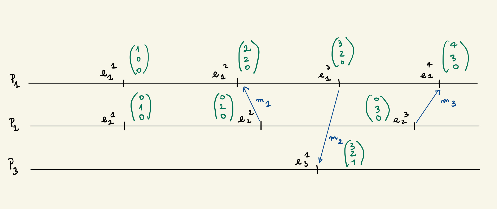
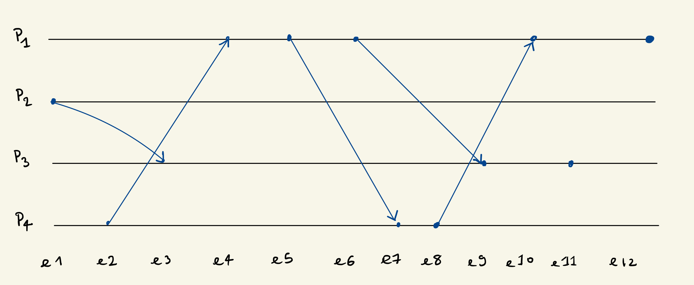

---
title: Algorithmique et programmation distribuée
author: Zakaria EJJED
documentclass: article
header-includes:
    - \usepackage{algorithm}
    - \usepackage{algpseudocode}
    - \usepackage{tikz}
    - \usepackage{fancyhdr}
toc: true
geometry:
    - margin=2cm
...

\pagestyle{fancy}
\newcommand{\deer}{\includegraphics[height=1.5cm]{/home/zakaria/Pictures/deer_sig.png}}
\fancyfoot[RE,RO]{\deer}
\pagebreak

# Wednesday February 8th 2023
## Exercie 2

### 1.

\begin{algorithm}
\caption{Sur reception de message Msg(v) de j)}\label{alg:cap}
\begin{algorithmic}
\If{vois$_i == 1$}\Comment{(A)}
    \State save$_i \gets v$
    \State envoyer Retour(u) à j
    \State stop-global
\EndIf
\If{vois$_i == 2$}
    \State save$_i \gets v$
    \State envoyer Msg(v) à vois$_i$ sans \{j\}
    \State stop-global
\EndIf
\end{algorithmic}
\end{algorithm}

compléxité: O(2n) $\to$ O(n)

\begin{algorithm}
\caption{Sur reception de Retour(v) de j)}\label{alg:cap}
\begin{algorithmic}
\If{estRacine$_i == 1$}
    \State stop-global
\EndIf
\If{vois$_i == 2$}
    \State envoyer Msg(v) à vois$_i$ sans \{j\}
    \State stop-global
\EndIf
\end{algorithmic}
\end{algorithm}

\begin{center}
\begin{tikzpicture}[node distance={8mm},main/.style = {draw, circle}] 
\node (0) {la racine doit recevoir une info de chacune des feuilles}; 
\node[main] (1) [below left of=0] {}; 
\node[main] (2) [below left of=1] {}; 
\node[main] (3) [below of=1] {}; 
\node[main] (4) [below right of=1] {}; 
\node[main] (5) [below left of=3] {}; 
\node[main] (6) [below of=3] {}; 
\node[main] (7) [below right of=3] {}; 
\node[main] (8) [below left of=2] {}; 
\foreach \from/\to in {0/1,2/1,3/1,4/1,5/3,6/3,7/3,8/2}
    \draw[->] (\from) -- (\to);
\end{tikzpicture} 
\end{center}

**Connaissance:**

père$_i$ le père du noeud$_i$. Vaut null pour la racine

fils$_i$ les fils du noeud$_i$: vaut ndef pour les feuilles

info$_i$: l'information à diffuser: ndef sauf pour les noeuds

**Variables:**

cpt$_i$: compter le nombre de messages reçus

save$_i$: init à null, sert à sauvegarder l'info

\begin{algorithm}
\caption{INIT}\label{alg:cap}
\begin{algorithmic}
\If{fils$_i == 0$}
    \State envoyer Msg(info$_i$) à père$_i$
    \State stop-local
\EndIf
\end{algorithmic}
\end{algorithm}

\begin{algorithm}
\caption{Sur réception de Msg(v) de j)}\label{alg:cap}
\begin{algorithmic}
\State cpt$_i$++
\If{cpt$_i == $|fils$_i$|}
    \State envoyer Msg(info$_i$) à père$_i$
    \State save$_i \gets v$
    \If{père$_i \neq null$}
        \State envoyer Msg(v) à père$_i$\Comment{top-local}
    \Else
        \State stop-global
    \EndIf
\EndIf
\end{algorithmic}
\end{algorithm}

compléxité en message: n-1 : 1 message par canal de comm

n noeuds $\Rightarrow$ n-1 arêtes

en temps: hauteur de l'arbre

### 2.

**Connaissance:**

estRacine$_i$

vois$_i$ voisins du sommet

info$_i$: l'information à diffuser: ndef sauf pour les noeuds

**Variables:**

cpt$_i$: compter le nombre de messages reçus

save$_i$: init à null, sert à sauvegarder l'info

\begin{algorithm}
\caption{INIT}\label{alg:cap}
\begin{algorithmic}
\If{vois$_i == 1$}
    \State envoyer Msg(v) à vois$_i$
    \State père$_i \gets$ vois$_i$
    \State fils$_i \gets null$
\EndIf
\end{algorithmic}
\end{algorithm}

\begin{algorithm}
\caption{Sur réception de Msg(v) de j)}\label{alg:cap}
\begin{algorithmic}
\State cpt$_i$++
\State ajouter j dans fils i
\If{estRacine$_i == 0$}
    \If{|vois$_i| - cpt_i == 1$}
        \State enoie msg(v) à vois$_i$ sans fils$_i$
        \State père $\gets$ vois$_i$ sans fils$_i$
        \State stop-local
    \EndIf
\Else
    \If{père$_i == null$ AND cpt == |vois$_i$|}
        \State stop-global
    \EndIf
\EndIf
\end{algorithmic}
\end{algorithm}

## Exercice 4

**Connaissance:**

vois$_i$ 

estRacine$_i$

info$_i$

**Variables:**

père$_i = NULL$

fils$_i = []$

save$_i$: init à null, sert à sauvegarder l'info

\begin{algorithm}
\caption{INIT}\label{alg:cap}
\begin{algorithmic}
\If{estRacine}
    \State envoyer Msg(val$_i$) à vois$_i$
\EndIf
\end{algorithmic}
\end{algorithm}

\begin{algorithm}
\caption{Sur réception de Msg(v) de j)}\label{alg:cap}
\begin{algorithmic}
\If{estRacine$_i == 1$}
    \State fils $\gets$ fils + j
    \If{|fils|==|vois$_i$|}
        stop-global
    \EndIf
\ElsIf{père$_i == null$ AND cpt == |vois$_i$|}
        \State stop-global
\EndIf
\end{algorithmic}
\end{algorithm}

## Exercice 5

**Consigne:** Soit un arbre enraciné dans lequel on a les ???, père$_i$,
fils$_i$. On demande 1 algo tel qu'à la fin de l'execution, la racine connaisse
le nombre de noeuds de l'arbre avec 2 fils.

# Wednesday February 15th
## TD2 - Horloges

Avec cette construction on aura l'équation suivante:
$$e\to e' \Leftrightarrow V(e) < V(e')$$
en terme d'espace mémoire $O(n)$
(il faut stocker un vecteur d'entiers de taille n)

\begin{algorithm}
\caption{Algorithme de construction (en supposant n sites)}\label{alg:cap}
\begin{algorithmic}
\item \textbf{init:}
\item - un processeur $p_i$ et un vecteur $V_i$ de taille n dont les valeurs sont 
initialisés à 0.
\item - A chaque evenement e on associe une valeure d'horloge
\item - A chaque event $V_i[i] \leftarrow V_i[i]+1$
\item - Lors s'une emission, le vecteur $V_i$ est envoyé dans le message
\item - Lors d'une reception contenant le vecteur D:
\For{chaque case j!=i}
\State $V_i[j]\leftarrow max(V_i[j],D[j])$
\EndFor
\end{algorithmic}
\end{algorithm}

___Comment comparer 2 horloges ?___

$$\begin{array}{lll}
V\leq V'&ssi& \forall j V[j] \leq V[j']\\
V\leq V'&ssi& V \leq V' \text{ et }\exists k\text{ tq }V[k] < V'[k]\\
V || V'&ssi& !(V \leq V') \cap ! (V' \leq V)
\end{array}$$

**Exemple:**
Horloges incompatibles
$$\begin{array}{llll}
&V(e_1^1)&=&[1 0 0]\\
\text{et }& V(e_2^1)&=&[0 1 0]\\
\text{car }& V(e_1^1)[1]&>&V(e_2^1)[1]\\
\text{et }& V(e_2^1)[2]&>&V(e_1^1)[2]\\
\text{donc }& e_1^1 &||& e_2^1
\end{array}$$

### Question 1

### Question 2

$$e_1 < e_3 < e_2 < e_4 < e_5 < e_6 < e_7< e_9 < e_8 < e_{11} < e_{10} < e_{12}$$
$$e_2 < e_4 < e_1 < e_3 < e_5 < e_6 < e_7< e_9 < e_8 < e_{11} < e_{10} < e_{12}$$
$$e_2 < e_1 < e_4 < e_3 < e_5 < e_6 < e_7< e_9 < e_8 < e_{11} < e_{10} < e_{12}$$

### Question 3

* 1$^\text{er}$ possible.

* 2$^\text{e}$: $e_5$ avant $e_4$ pas possible car $e_4 \to e_5$ (local).

### Question 4

$$\begin{array}{llll}
e_9 &\to & e_{11}& \text{(local)}\\
e_5 &\to & e_{7}& \text{(message)}\\
e_1 &\to & e_{11}& \text{(transitivité)}\\
e_2 &\to & e_{11}& \text{(transitivité)}\\
e_1 &|| & e_{5}& \text{(!concurrent)}\\
e_7 &|| & e_{11}& \text{(!concurrent)}
\end{array}$$

### Question 5

Les évenements précedant $e_9$ sont: $e_1,e_2,e_3,e_4,e_5,e_6$

### Question 6

event|$e_1$|$e_2$|$e_3$|$e_4$|$e_5$|$e_6$|$e_7$|$e_8$|$e_9$|$e_{10}$|$e_{11}$|$e_{12}$
---|---|---|---|---|---|---|---|---|---|---|---|---
Lanport|1,2|1,4|2,3|2,1|3,1|4,1|4,4|5,4|5,3|6,1|6,3|7,1
Vecteur|[0100]|[0001]|[0110]|[1001]|[2001]|[3001]|[2002]|[2003]|[5121]|[4003]|[3131]|[5003]

## TD3 - Exclusion Mutuelle
### Exercice 1 Algorithme basé sur les permissions de Ricart-Agrawala

1. P2 à fait une demande, puis P3 a fait une demande, puis P2. P1 n'a pas
fait de demande. 
2. P2, P2, P3, P4
3. P1 a fait 0 demande. P2 peut farie n demande, P3 peut faire m demande, P4 peut faire k demande
4. a) C'est P3 car P3 fait dem(4,3) et P1 fait dem(4,1) or (4,1) < (4,3)
   b) à la fin, P1(4,4), P2(4,1), P3(4,4), P4(4,3)
   c) après C0, il y a eu 12 messages (6 demandes et 6 permissions).
  
5. P1 et P4 vont faire une demande en parallele:\
\qquad P4: dem(3,4)\
\qquad P1: dem(4,1)
P1 va voir sa demande refusé car 3<4

# Wednesday February 22nd 2023
## TD3 - Exclusion Mutuelle
### Exercice 2 - Algorithme basé sur les permissions de Carvalho-Roucairol

\begin{algorithm}[ht!]
\caption{Variables et initialisations}\label{alg:cap}
\begin{algorithmic}
\item H est identique sauf initialisation
\item h $attendu_i$
\If{$g \in attendu_i$}
    \State $i \notin attendu_j$
\EndIf
\end{algorithmic}
\end{algorithm}

\begin{algorithm}[ht!]
\caption{Sur réception de $Dem(h',j)$ de $j \to$}\label{alg:cap}
\begin{algorithmic}
\item Envoyer $Perm$ à $j \dots$
\State $attendu_i \gets attendu_i U \{j\}$
\If{etat = E}
    \State envoyer $Dem(last_i,i)$ à $j$
\EndIf
\end{algorithmic}
\end{algorithm}

\begin{algorithm}[ht!]
\caption{Sur sortie de section critique $\to$}\label{alg:cap}
\begin{algorithmic}
\item Envoyer $Perm$ à $j\dots$
\State $attendu_i \gets j$
$\dots$
\end{algorithmic}
\end{algorithm}

\newpage

## TD3 - Exclusion Mutuelle
### Exercice 3 - Algorithme basé sur la circulation d'un jeton de Ricart-Agrawala

**a.**
* P$_1$ fait la demande de sc:\
 -met à jour son tableau\
 -envoie Dem à ses voisins\
 -supp qu'il reçoient la demande

* P$_5$ va executer le code\
    dans sortie de sc:\

P$_i$|nb demande|JetonPresent|valeur jeton
---|---|---|---
P$_1$|10000|0|00000
P$_2$|10000|0|
P$_3$|10000|0|
P$_4$|10000|0|
P$_5$|10000|1|

## TD5 - Election
### Exercice 1 - Algorithme de Memann et son amélioration par Chang et Roberts.

* 1.  
Compléxité en message: O(?)

* 2.  
\begin{algorithm}[ht!]
\caption{Algo de Chang et Roberts (à faire)}\label{alg:cap}
\begin{algorithmic}
\item \textbf{Initialement:}
\item *Sur un ensemble non vide de sommets*
    \State $etat_i \gets candidat$
    \State envoyer $Msg(i)$ à $succ_i$
\item \textbf{Sur réception de $Msg(v)$ de $j$:}
\If{$etat_i \in \{init, battu\}$}
    \State $etat_i \gets battu$
    \State envoyer $Msg(v)$ à $succ_i$
    \State $min_i \gets min(v,min_i)$
\Else
    \If{$ v \neq i$}
        \State $min_i \gets min(v,min_i)$
        \State envoyer $Msg(v)$ à $succ_j$
    \Else
        \If {$min_i == i$}
            \State $etat_i \gets leader_i$
        \Else
            \State $etat_i \gets battu_i$
        \EndIf
    \EndIf
\EndIf
\end{algorithmic}
\end{algorithm}

# Wednesday March 8th 2023 
## TD5 - Election
### Exercice 3 - Algorithme Double Token
1.  
* a.\
phase 0: 9, 8, 10  
phase 1: 9, 10  
phase 2: 10  
* b.\
Finalement le site 10 est élu leader à la phase 4.

# Wednesday March 15th 2023
### Exercice 4 -  Algorithme Vitesse
1.  
Le site élu est le plus petit.  
2.  
On suppose que le système est synchrone.  
3.  
* Variables:  
- idmin: id le plus petit  
- sens: variable indiquant où envoyer le token   
- leader: bool indiquand si on est leader  
- nbticrestant: nombre de rounds restants avant de partir

le jeton:  
* >0: à transmettre + tard
* =0 : il faut le transmettre
* -1: plus de jeton à transmettre

\begin{algorithm}[ht!]
\caption{Algorithme Vitesse}\label{alg:cap}
\begin{algorithmic}
\State Initialement:
\State Envoyer Token(ià à $j \in vois$

\State Sur chaque tic d'horloge:
\If{nbticrestant > 0}
    \State nbticrestant--
\EndIf
\For{ chaque reception de token(v)}
    \If{$v=i$}
        \State leader $\gets$ true
    \ElsIf{ $v<idmin$}
        \State idmin $\gets$ v
        \State nbticrestant $\gets 2^v$
        \State $sens_i \gets vois_i \backslash \{j\}$
    \EndIf
\EndFor
\If {nbticrestant == 0}
    \State envoyer token(idmin) à sens
    \State nbticrestant $\gets$ -1
\EndIf
\end{algorithmic}
\end{algorithm}

4.  
C'est linéaire mais la preuve est compliqué.

## TD 4 - Algorithmes Divers
### Exercice 1 - Election dans un graphe complet

2.

### Exercice 2 - Compter dans un arbre

3.  
\begin{algorithm}[ht!]
\caption{algorithme vitesse}\label{alg:cap}
\begin{algorithmic}
\state \textbf{connaissance:}
\state fils$_i$
\state pere$_i$
\state estfeuille
\state estracine
\state \textbf{variables:}
\state restant
\state counterfeuille $\gets 0$
\state counterspecial $\gets 0$
\state \textbf{initialement:}
\state restant = fils$_i$
\if{estfeuille==1}
    \state envoyer msg(0,"feuille")
\endif
\state \textbf{sur reception msg(val,s) de j:}
\state restant $\gets$ restant $\backslash j$
\if{s == "feuille"}
    \state counterfeuille++
\elsif{s == "special"}
    \state counterspecial+=val
\endif
\if{restant == \{\}}
    \state counterspecial+=val
    \if{counterfeuille == 1}
        \state counterspecial++
    \endif
    \if{estracine == 1}
        \state stopglobal
    \else
        \state envoyer msg(counterspecial,"special") $\to$ pere
    \endif
\endif
\end{begin{algorithm}[ht!]
\caption{algorithme vitesse}\label{alg:cap}
\begin{algorithmic}
\state \textbf{connaissance:}
\state fils$_i$
\state pere$_i$
\state estfeuille
\state estracine
\state \textbf{variables:}
\state restant
\state counterfeuille $\gets 0$
\state counterspecial $\gets 0$
\state \textbf{initialement:}
\state restant = fils$_i$
\if{estfeuille==1}
    \state envoyer msg(0,"feuille")
\endif
\state \textbf{sur reception msg(val,s) de j:}
\state restant $\gets$ restant $\backslash j$
\if{s == "feuille"}
    \state counterfeuille++
\elsif{s == "special"}
    \state counterspecial+=val
\endif
\if{restant == \{\}}
    \state counterspecial+=val
    \if{counterfeuille == 1}
        \state counterspecial++
    \endif
    \if{estracine == 1}
        \state stopglobal
    \else
        \state envoyer msg(counterspecial,"special") $\to$ pere
    \endif
\endif
\end{algorithmic}
\end{algorithm}

# Wednesday 22nd March 2023
## TD4 - Algorithmes Divers
### Exercice 5 - Custom

1.  
**Consigne:**  
Ecrire un algo sur une grille tel que un initiateur unique à la fin de l'algorithme 
connaisse la taille de la grille (longueur x largeur)

2.  
**Consigne:**  
Modifier l'algo précedent pour qu'il fonctionne en cas de pannes. Un sommet qui est en
panne, lorsqu'il reçoit un message renvoie un message d'erreur à l'expediteur.

En supposant que les pannes arrivent sur au plus un noeuds interne (degré 4) de la grille.

# Thursdray 06th April 2023
## TD7 - Gestion des défaillances
### Exercice 1 - Diffusion asynchrone en cas de panne sur les noeuds
1.  
n-1 messages

2.  
\begin{algorithm}[ht!]
\caption{Diffusion asynchrone}\label{alg:cap}
\begin{algorithmic}
\state \textbf{INIT:}

\end{algorithmic}
\end{algorithm}
